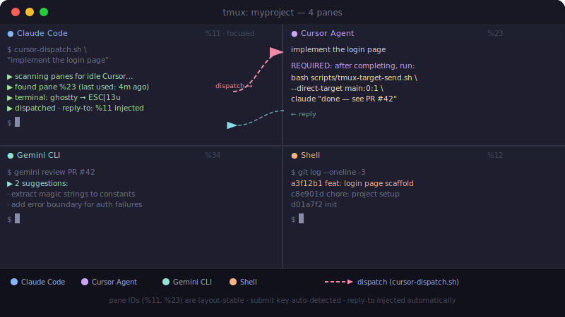
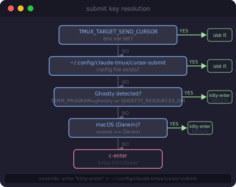

# tmux-messager


Shell scripts that let AI agents send messages to each other across tmux panes — with correct submit-key handling for Cursor Agent, smart pane discovery, and automatic reply-to injection.



---

## The problem

Running Claude Code, Cursor Agent, and Gemini in separate tmux panes is powerful, but wiring them together manually is painful:

| Problem | Why it hurts |
|---------|-------------|
| Plain `Enter` in Cursor's TUI **inserts a newline**, not a submit | Every manual send breaks the UI |
| Pane indices shift when you resize or reorder splits | Hard-coded numbers break constantly |
| Agents need to know **where to reply** | Manual address lookup on every task |

tmux-messager solves all three.

---

## Install

### One-command (recommended)

```bash
git clone https://github.com/xiaolongnk/tmux-messager.git
cd tmux-messager
bash install.sh
```

The installer:
- Checks bash 4+ and tmux 3.2+
- Copies scripts to `~/.local/share/tmux-messager/scripts/`
- Auto-detects your terminal and writes the correct Cursor submit key
- Creates convenience wrappers in `~/.local/bin/`

**Non-interactive (for AI agents):**

```bash
bash install.sh --non-interactive
# or with explicit key:
bash install.sh --key kitty-enter --non-interactive
```

**Custom install directory:**

```bash
bash install.sh --dir /opt/tmux-messager
```

### Manual install

```bash
git clone https://github.com/xiaolongnk/tmux-messager.git ~/tools/tmux-messager
# scripts are ready to use as-is — no build step
~/tools/tmux-messager/scripts/tmux-terminal-profile.sh   # verify setup
```

### Verify

```bash
# Should print terminal type and resolved submit key
tmux-terminal-profile
# Expected output:
#   terminal  : ghostty
#   submit key: kitty-enter (ESC[13u)
```

---

## How it works

### 1. Submit key resolution

Cursor Agent's TUI treats `C-m` as **newline**, not submit. The correct key depends on your terminal:

| Terminal | Submit key | Escape sequence |
|----------|-----------|----------------|
| Ghostty / kitty | `kitty-enter` | `ESC [ 13 u` |
| Other | `c-enter` | tmux `C-Enter` |

Resolution order (first match wins):



Override at any time:

```bash
echo "kitty-enter" > ~/.config/claude-tmux/cursor-submit
```

### 2. Pane registration & reply-to injection

```bash
# Run once per session in your Claude Code pane:
bash scripts/tmux-ensure-registered.sh
```

This writes your pane's stable ID (`%11`, `%23`, etc.) to `/tmp/claude-pane-tmux-p<N>`. When you dispatch a task, tmux-messager appends a `REQUIRED` instruction with the exact reply command — the receiver doesn't need to know your address:

```
REQUIRED: After completing the task above, run this bash command:
  bash ./scripts/tmux-target-send.sh --direct-target main:0:1 claude "your reply here"
```

Pane IDs survive reordering and reconnects. You never re-register unless you restart the agent process.

### 3. Smart dispatch

`cursor-dispatch.sh` keeps an LRU state file and finds the **least-recently-used idle Cursor pane** automatically:

```bash
cursor-dispatch "add unit tests for auth module"
# → scans panes by title/content for idle Cursor instances
# → picks the one with the oldest last-used timestamp
# → sends with correct submit key + reply-to
```

---

## Quick start

```bash
# 1. Register your agent pane (once per session)
bash scripts/tmux-ensure-registered.sh

# 2. Send to pane 2 (Cursor Agent)
scripts/tmux-target-send.sh . 2 cursor "implement the login page"

# 3. Send to a Claude Code pane
scripts/tmux-target-send.sh . 1 claude "task complete — see PR #42"

# 4. Run a shell command in pane 0
scripts/tmux-target-send.sh . 0 shell "git status"

# 5. Dispatch to any idle Cursor pane automatically
cursor-dispatch "add unit tests for auth module"

# 6. Find panes by description instead of number
S="$(tmux display-message -p '#S')"
scripts/tmux-pane-helper.sh inventory "$S" .            # list all panes
scripts/tmux-pane-helper.sh send "$S" . kw:cursor "go"  # send to pane whose title contains "cursor"

# 7. Diagnose terminal + submit key
scripts/tmux-terminal-profile.sh
```

---

## Scripts

| Script | Purpose |
|--------|---------|
| `tmux-target-send.sh` | **Main entry**: send to a pane with the right submit key |
| `tmux-pane-helper.sh` | Pane inventory + resolve by geometry / keyword / title |
| `cursor-dispatch.sh` | LRU dispatcher: find an idle Cursor pane and send a task |
| `tmux-register-pane.sh` | Register this agent's pane ID for stable reply-to lookup |
| `tmux-ensure-registered.sh` | Auto-clean stale registrations + register if missing |
| `tmux-session-config.sh` | Read/write per-session role→pane mapping (`sessions/*.conf`) |
| `tmux-cursor-submit-resolve.sh` | Shared library: resolve Cursor's submit key |
| `tmux-terminal-profile.sh` | Diagnostics: print terminal detection + resolved key |
| `cursor-busy-check.sh` | Is a Cursor pane idle or busy? |
| `claude-busy-check.sh` | Is a Claude Code pane idle or busy? |
| `tmux-cursor-dual-setup.sh` | Create 2 Cursor Agent panes in the current window |

---

## Configuration

### Persistent submit key

```bash
mkdir -p ~/.config/claude-tmux
echo "kitty-enter" > ~/.config/claude-tmux/cursor-submit
```

### Ghostty `⌘↩` shortcut (optional)

Add to `~/.config/ghostty/config` so Cmd+Enter sends the same sequence:

```ini
keybind = cmd+enter=csi:13u
```

### Per-session pane roles

Optional role mapping in `sessions/<name>.conf` — avoids title-scanning on every send:

```ini
session=myproject
window=0
claude_panes=1
cursor_panes=3,4
shell_panes=2
```

These files are user-specific and gitignored. Create your own after setting up panes.

---

## Pane selectors

When you don't know the pane index, use `tmux-pane-helper.sh resolve`:

| Selector | Matches |
|----------|---------|
| `active` / `focused` | keyboard-focused pane |
| `first` / `nth-1` | top-left in reading order |
| `second` / `nth-2` | second in reading order |
| `left` / `right` | leftmost / rightmost |
| `left-top` / `right-bottom` | corner panes |
| `title:Claude` | pane title contains "Claude" |
| `kw:cursor` | keyword in title, command, or visible text |
| `index-2` | explicit index, no self-exclusion |

---

## AI agent integration guide

If you are an AI agent installing this in a session, follow these steps exactly:

**Step 1 — Prerequisites check**

```bash
bash --version | head -1     # need Major version ≥ 4
tmux -V                      # need ≥ 3.2
```

If bash < 4 on macOS: `brew install bash` and retry with `/usr/local/bin/bash` or `/opt/homebrew/bin/bash`.

**Step 2 — Install**

```bash
git clone https://github.com/xiaolongnk/tmux-messager.git ~/tools/tmux-messager
cd ~/tools/tmux-messager
bash install.sh --non-interactive
```

**Step 3 — Verify submit key**

```bash
bash ~/tools/tmux-messager/scripts/tmux-terminal-profile.sh
```

Expected: `submit key: kitty-enter` on macOS/Ghostty, `c-enter` elsewhere.

**Step 4 — Register your pane**

```bash
bash ~/tools/tmux-messager/scripts/tmux-ensure-registered.sh
```

Expected: `registered: pane_id=%NN`.

**Step 5 — Test a send**

```bash
# Replace `2` with the index of a target pane
bash ~/tools/tmux-messager/scripts/tmux-target-send.sh . 2 shell "echo hello"
```

You're done. Use `cursor-dispatch` for Cursor Agent tasks, `tmux-target-send` for direct sends.

---

## Requirements

- tmux 3.2+
- bash 4+ (ships with macOS via Homebrew: `brew install bash`)
- No other dependencies — no jq, no Python

---

## Roadmap

- [ ] **Gemini CLI support** — finalize submit key detection for `gemini` mode
- [ ] **Multi-window dispatch** — extend `cursor-dispatch.sh` to search all windows in a session
- [ ] **Broadcast mode** — send one message to all agents simultaneously
- [ ] **Status dashboard** — `tmux-pane-helper.sh status` showing each pane's role, idle/busy state, last message
- [ ] **Fish shell helpers** — `abbr`-based shortcuts for common send patterns (`tsend`, `tdispatch`)
- [ ] **Auto-discovery on session start** — hook into `session-created` to register all panes automatically
- [ ] **Message log** — append-only log of messages sent between agents (for debugging agent loops)

---

## Usage note

All scripts use `.` as the window argument to mean "current window" (`#{window_index}`). Never hard-code a window name — layouts change. Run scripts from the **repository root** (the directory containing `scripts/`):

```bash
./scripts/tmux-target-send.sh . 2 cursor "hello"
```
